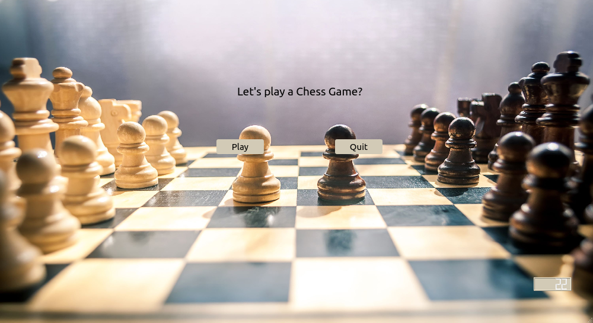

# ChessGame
Welcome to the 3D Chess Game: Play against a friend, challenge the computer, or test your skills against AI. The choice is yours!

**Current Status:** Under development 🛠️

## Introduction
Dive into the world of chess with an exciting 3D or 2D Chess Game, crafted using Qt Creator. 

## Installation
To explore this project for inspiration or learning, follow these steps:

1. Create an account on Qt Creator.
2. Download the project files.
3. Log in to your account, click 'Open Project,' and select the file with a .pro extension.
4. Before running the project, ensure the following packages are installed: libva-dev and qtmultimedia5-dev.

For Ubuntu or similar Linux distributions, open a terminal and enter:

```bash
sudo apt-get install libva-dev && sudo apt-get install qtmultimedia5-dev
```

For Windows users, please note that audio file compatibility might be an issue. These packages enable audio features, and since the project is developed on Ubuntu, resolving this issue on Windows may be more complex. Best of luck!

Ready to play chess?



## Usage
The game is easy to navigate. Simply click 'Play,' and a new window will open, allowing you to choose your preferred game options. Have fun!
